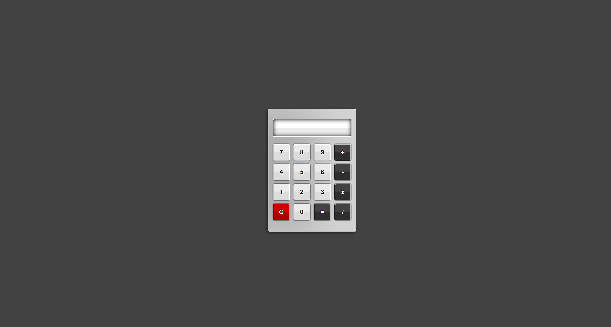

# Calculator

## 🧮 Simple Calculator

This is a basic calculator web application built using **HTML** and **CSS**. It performs standard arithmetic operations like addition, subtraction, multiplication, and division. The layout mimics a physical calculator with a neat and responsive UI.

### 🔧 Features
- Fully functional calculator UI  
- Supports basic operations: `+`, `-`, `×`, `÷`  
- Clean, minimalist design  
- Responsive layout  
- Built using pure HTML & CSS (no JavaScript)

### 🚀 Preview

Below is a screenshot of the calculator in action:

